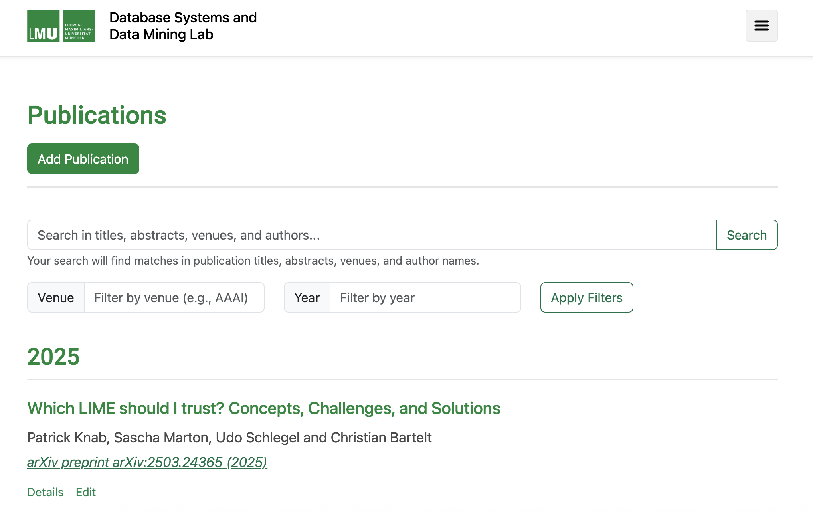

# Publications System

A Docker-based publication list system that allows users to manage academic publications. This system consists of a FastAPI backend and a React frontend, both containerized with Docker.



## Features

- **View Publications**: Browse and search through the list of publications
- **Advanced Filtering**: Filter publications by author, venue, year, and keywords
- **Search Functionality**: Search publications by title, abstract, or venue
- **User Authentication**: Register and login to access administrative features
- **Publication Management**: Add, edit, and delete publications (for authenticated users)
- **BibTeX Support**: 
  - Import publications from BibTeX data (single entry or batch import)
  - Import publications from BibTeX files 
  - Export individual publications as BibTeX
- **JSON Export**: Export filtered publication lists as JSON
- **Author Management**: Automatically create new authors or link to existing ones
- **Pagination**: Browse through large publication lists with pagination
- **Publication Details**: View comprehensive details for each publication
- **Duplicate Detection**: Prevent duplicate entries during BibTeX import
- **Error Handling**: Get detailed feedback on import failures
- **Publication Types**: Support for different academic publication types
- **DOI and URL Support**: Store and display DOI and URL for easy reference

## System Requirements

- Docker and Docker Compose installed on your system
- Internet connection for pulling base images

## Getting Started

### Environment Setup

1. Create a `.env` file in the root directory (copy from `.env.example`):
   ```bash
   cp .env.example .env
   ```

2. Edit the `.env` file and add your API keys:
   - `HF_TOKEN`: Your Hugging Face API token (required for accessing HF models)
   - `NVIDIA_TOKEN`: Your NVIDIA NIM API key (optional, but recommended for better performance)
   
   **Note**: The system uses NVIDIA NIM API for text-to-BibTeX conversion by default, with automatic fallback to the local Llama model if the API is unavailable or the key is not set.

### Running the Application

1. Clone this repository:
   ```
   git clone https://github.com/merowech/basic-publications-system.git
   cd basic-publications-system
   ```

2. Start the application using Docker Compose:
   ```
   docker-compose up -d
   ```

3. Access the application:
   - Frontend: http://localhost:3000
   - Backend API: http://localhost:8000
   - API Documentation: http://localhost:8000/docs

### Using the Application

1. **Browse Publications**:
   - Visit the homepage to see all publications
   - Click on author badges to filter by specific author
   - Use the search box to find publications by title, abstract, or venue
   - Filter publications by year, venue, or keywords using the filter options
   - View up to 1000 publications per page with pagination controls

2. **View Publication Details**:
   - Click on a publication title to see its full details including abstract
   - See all authors with their affiliations
   - Access publication metadata including DOI, URL, and publication type
   - Export the publication as BibTeX from the details page

3. **User Registration and Login**:
   - Register a new account with username, email and password
   - Log in to access administrative features
   - Manage your user profile

4. **Managing Publications** (requires authentication):
   - Add new publications manually with the form interface
   - Import publications from BibTeX data (single entry or batch)
   - Import publications from BibTeX files with error reporting
   - Edit existing publications (title, authors, year, venue, etc.)
   - Delete publications you've created
   - Maintain author order for correct citation formatting

5. **BibTeX Management**:
   - Import publications from BibTeX strings or files
   - Export individual publications as BibTeX
   - Automatic duplicate detection during import
   - Detailed error reporting for failed imports

6. **Data Export**:
   - Export individual publications as BibTeX
   - Export filtered or searched publication lists as JSON
   - Use exported data for integration with other systems

7. **Author Management**:
   - Authors are automatically created during publication import
   - Link publications to existing authors
   - Maintain consistent author information across publications
   - Filter publications by specific author

## Development

### Project Structure

- `backend/`: FastAPI backend service
  - `app/`: Application code
    - `models/`: Database models
    - `routers/`: API endpoints for publications and users
    - `schemas/`: Pydantic schemas for data validation
    - `auth/`: Authentication logic and JWT handling
    - `utils/`: Utility functions including BibTeX processing
- `frontend/`: React frontend
  - `src/`: Source code
    - `components/`: React components (Navbar, Footer)
    - `pages/`: Page components for all features
    - `services/`: API services for backend communication
    - `styles/`: CSS styles for the application
- `data/`: Persistent data storage and import utilities
  - `publications.db`: SQLite database for development
  - `mcml_matching/`: Scripts for publication matching and BibTeX extraction
  - `old_bib_online_crawling/`: JavaScript utilities for crawling bibliographic data
  - `old_bib_sql_dump/`: SQL import utilities and BibTeX converters

### Data Processing Capabilities

The system includes several utilities for importing publication data:

1. **BibTeX Processing**: Parse and generate BibTeX entries with proper formatting
2. **SQL Import**: Import publications from SQL dumps via the included utilities
3. **Web Crawling**: Extract publication data from web sources
4. **Batch Processing**: Handle multiple publications in a single import operation
5. **Data Validation**: Validate imported data with Pydantic schemas
6. **Error Handling**: Detailed error reporting for failed imports

### Customization

You can customize this application by:

1. Modifying the environment variables in `docker-compose.yml`
2. Changing the database by updating the `DATABASE_URL` environment variable
3. Extending the data models in `backend/app/models/models.py`
4. Adding new API endpoints in the `backend/app/routers/` directory

## Security Notes

For production deployment:

1. Change the `SECRET_KEY` in the `docker-compose.yml` file
2. Configure CORS settings in `backend/app/main.py`
3. Set up HTTPS for both frontend and backend
4. Consider using a more robust database like PostgreSQL

## License

This project is licensed under the MIT License - see the LICENSE file for details.
